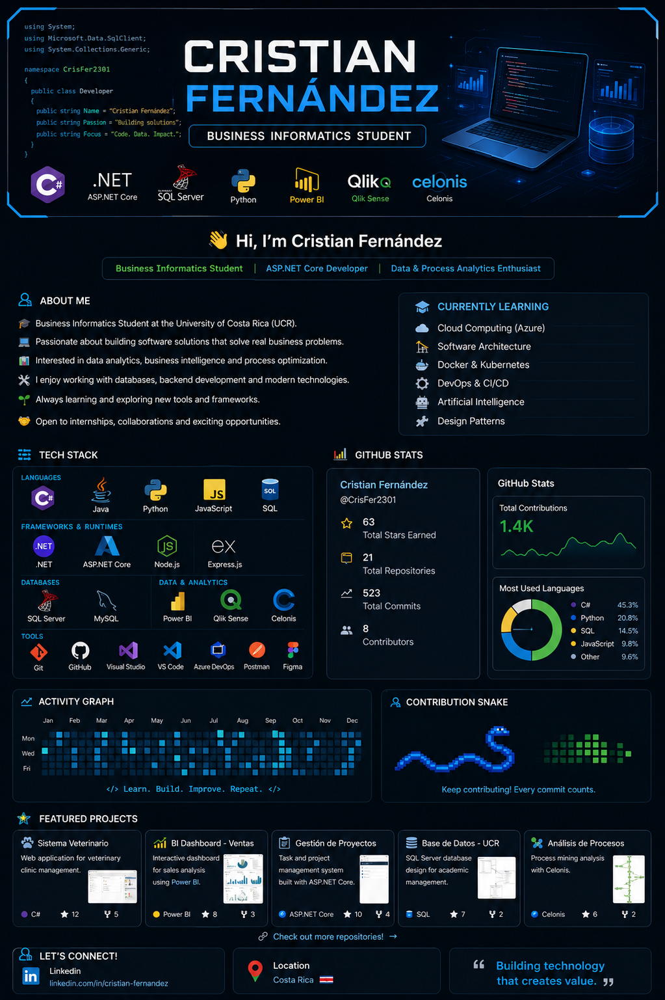

  

<h1 align="center">Hi 👋, I'm Cristian Fernández</h1>

<h3 align="center">
Business Informatics Student • ASP.NET Core Developer • Data & Process Analytics Enthusiast
</h3>

  

---

# 💫 About Me

- 💻 Passionate about building software that solves real-world business problems.
- 🌐 Focused on Backend Development and Software Engineering.
- 🗄️ Experienced with SQL Server database design and development.
- 📊 Interested in Data Analytics, Business Intelligence and Process Optimization.
- 🚀 Constantly learning new technologies and best practices.
- 🤝 Open to internships, collaborations and exciting software projects.

---

# 🚀 Current Focus

- 🌐 ASP.NET Core
- 🗄️ SQL Server
- ☁️ Cloud Computing
- 🤖 Artificial Intelligence
- 📊 Business Intelligence
- ⚙️ Software Architecture

---

# 💻 Tech Stack

  

  
  
  
  

---

# 📊 GitHub Statistics

  
  

---

# 🔥 Contribution Streak

  

---

# 📈 Activity Graph

  

---

# 🏆 GitHub Achievements

  

---

# 📂 Featured Projects

⭐ Veterinary Management System

⭐ ASP.NET Core Applications

⭐ SQL Server Database Projects

⭐ Business Intelligence Dashboards

⭐ Process Mining Solutions

---

# 📚 Currently Learning

- Cloud Computing (Azure)
- Docker
- DevOps
- Clean Architecture
- Design Patterns
- Artificial Intelligence

---

# 🌎 Connect With Me

  
  

---

  

<h3 align="center">
  💙 *Building technology that creates value.*
</h3>
